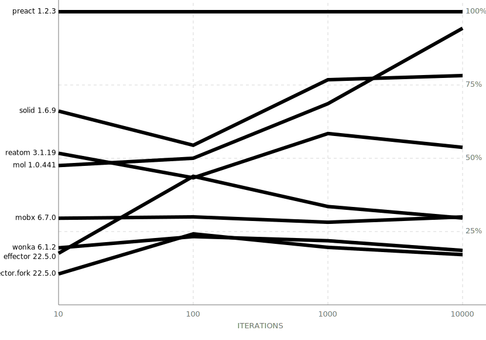
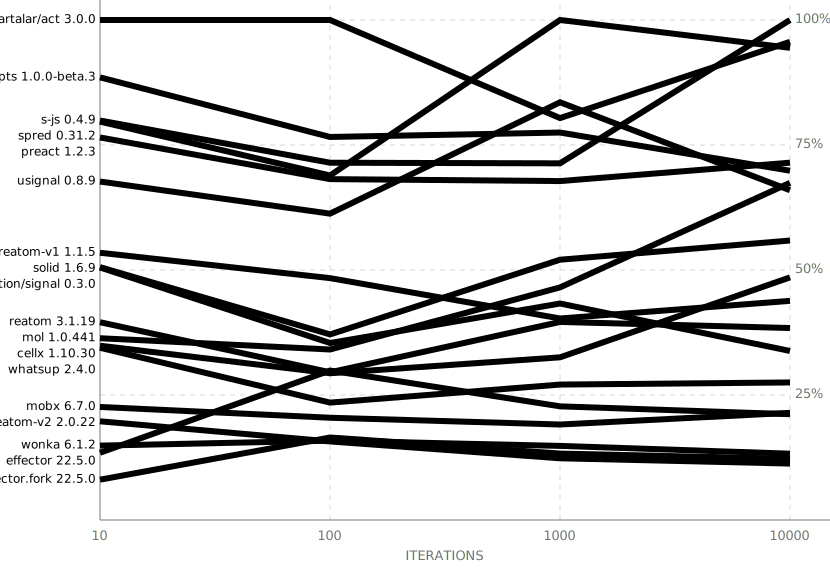
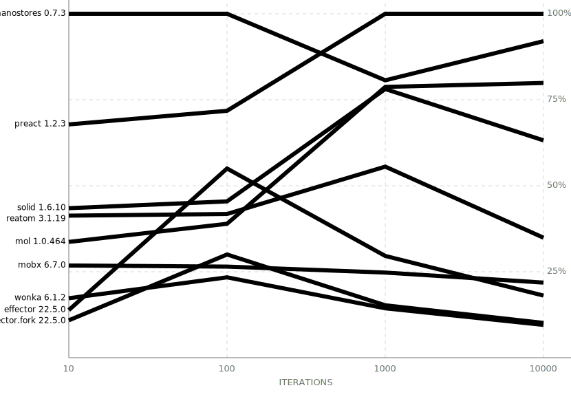

This benchmark measured computation of complex computed reactive unit when it deep children change.

The rules:

- A user space computations should be dumb as possible, to prevent it impact to the measurement. Also, it should return a new value each time to force all dependencies recomputation. For these purposes we use integer summarization, as it light, pure and plain for JIT.
- Each update for each library should **not** go one after the other to prevent unexpected JIT overoptimizations. It is not how real applications work. In the iteration loop we apply the update (iteration counter) only once to each library. To prevent performance influence between two nearby tests we shuffle the list of tests before each iteration.
- To prevent JIT influence there is a minimum timeout after each iteration. It is not very honest, but there is no clear way to measure the library overhead and it JIT usage.

The charts shows median value. If you will start the bench by yourself you could see average, minimum and maximum (5%) values in your console.

The results above is a median value in percent from a fastest library for each iteration loop.

> [Notes about Reatom performance](https://www.reatom.dev/#how-performant-reatom-is) 🤗

> Run it localy to see detailed numbers (node 18 required).

## Results

### AMD_EPYC_7B13

all results

<!-- ### AMD_EPYC_7B13 -->

### Apple_M1

all results

<!-- ### Apple_M1 -->
